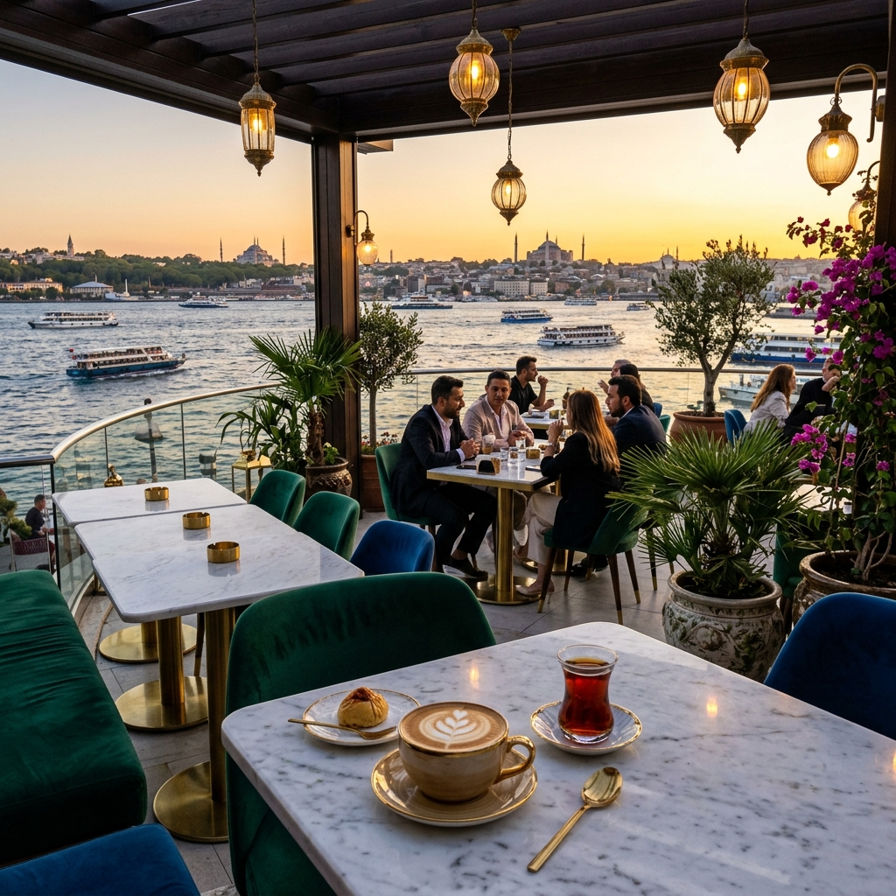

# Maré Istanbul — Café Landing Page

A responsive landing-page concept for a fictional Istanbul café, with a visual direction inspired by the Bosphorus.



## Highlights

- Hero, menu, interior, dessert, and terrace sections
- Responsive navigation and lightweight page interactions
- Custom image-led visual design
- No framework or build step

## Run locally

Clone the repository and open `index.html` in a modern browser. For a local HTTP server, use VS Code Live Server or:

```bash
python -m http.server 8000
```

Then open <http://localhost:8000>.

## Project files

- `index.html` — page structure and content
- `style.css` — layout, responsive rules, and visual styling
- `script.js` — browser interactions
- `hero.png`, `interior.png`, `dessert.png`, `terrace-night.png`, `menu-coffee.png` — image assets

## Scope

This repository is a frontend concept. It does not include online ordering, payment processing, or a backend service.
